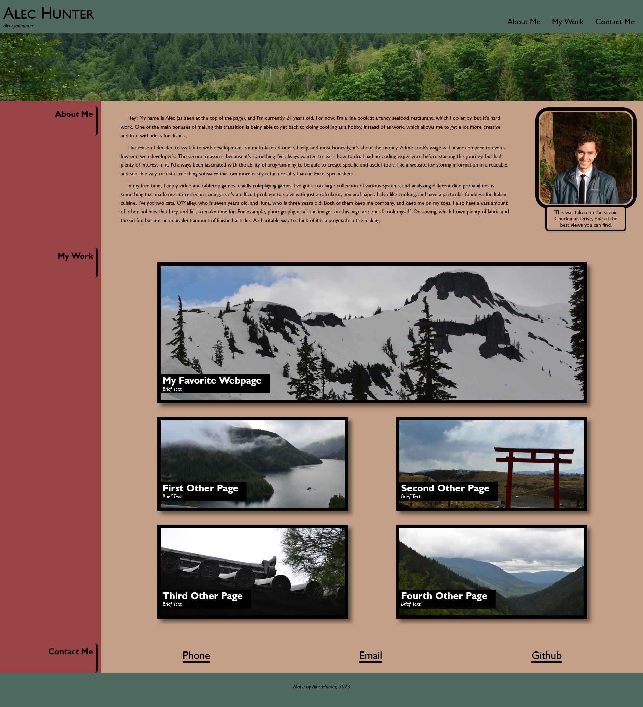
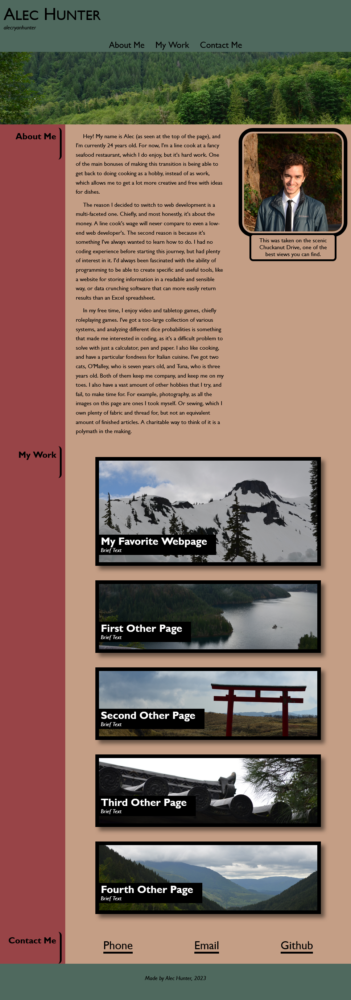
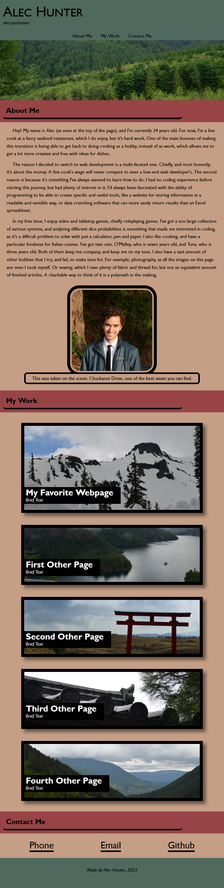

# Bootcamp Challenge Two

## Description

This is a portfolio of my work for employers to view. Currently, I have little work to show, but as I progress in the program and in personal projects, I can easily add it to the webpage. There is spots for 5 webpages, with the one I am most proud of displayed more prominently than the others.

This project taught me a lot about CSS styling. My original vision was much grander, but as I progressed I realized I was unable to learn this in the timeframe available to me. This taught me a crucial lesson about setting clear and realistic expectations from the very beginning, often assisted by a drawing tool or other way to roughly block out the structure of the site. I also learned a lot better about how to manage a workflow when building a webpage from scratch. This goes hand-in-hand with the clear layout, but it helps a lot to lay out all the HTML first, and then go through and style everything with CSS, instead of doing one section's HTMl, then it's CSS, then the next section and so on and so forth. The latter way, which is how I started, caused a lot of friction between the different sections of the webpage that took me quite a while to rectify.

In addition to the high-concept workflow and process knowledge I gained, I also learned a lot about specific CSS tools, like flexboxes and positioning. I was able to create a "sticky" sidebar that scrolled with the page, which was the only thing that remained from my original grand vision. I also got a much better understanding of flexbox, specifically using the different orientations alongside a media screen to quickly change the layout with resolution change.

Overall, this was a very challenging but rewarding, and dare I say fun, assignment to work on. I look forward to revising it in the future.

## Features

This webpage features many useful features including, but not limited to:
* A nav bar with working links to the About Me, My Work, and Contact Me sections.
* :hover and :active formatting on the nav bar to clarify it's use.
* Dynamic webpage organization for easy viewing across different screen sizes.
* A scrolling sidebar heading that stays near it's relevant section.
* Five link cards to other websites, with one being emphasized.
* :hover and :active effects on the cards to clarify use and add visual flair.
* A contact me section with specific phone, email, and github links which are tagged to open the correct program upon clicking.

## Website Link

The live website can be found [here!](https://alecryanhunter.github.io/bootcamp-challenge-two)

## Credits
Would not have been possible without the fantastic MDN Web Docs, which were an invaluable asset throughout this process.

All photos taken by me.

For the curious:
 * The header is from Mt. Index along Highway 2.
 * The favorite webpage is from Mt. Baker, in the winter.
 * The first webpage card is from Cascade Pass, along Highway 20.
 * The second wepage card is from Mototsumiya Shrine, in Hakone, Japan.
 * The third webpage card is from Higashiyama Jisho-ji, in Kyoto, Japan.
 * The fourth webpage card is from the North Cascades, near Mt. Baker.

## Screenshots

### Desktop View

### Tablet View

### Mobile View
